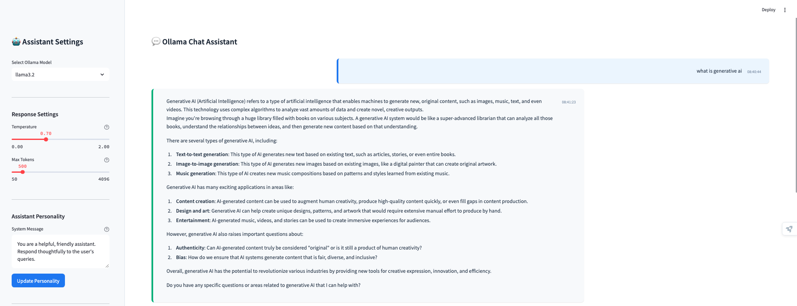
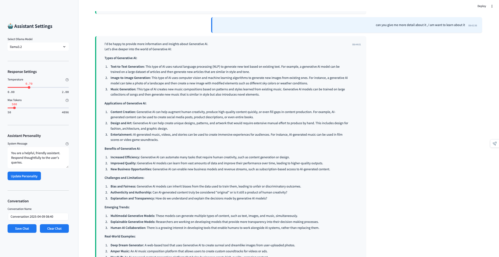

# Ollama Chat Assistant




A sleek, modern chat interface for interacting with Ollama language models, built with Streamlit and LangChain. This application provides a user-friendly way to chat with locally hosted language models through Ollama.

## Features

- 💬 Clean, intuitive chat interface with modern styling
- 🤖 Support for multiple Ollama models (mistral, llama3.2)
- 🎛️ Adjustable generation parameters (temperature, max tokens)
- 🧠 Customizable assistant personality via system messages
- 💾 Save and load conversation history
- ⏱️ Message timestamps for better conversation tracking
- 🎨 Responsive UI with custom CSS styling

## Prerequisites

- Python 3.8 or higher
- [Ollama](https://ollama.ai/) installed and running locally
- Required Ollama models pulled (e.g., `ollama pull mistral`, `ollama pull llama3.2`)

## Installation

1. Clone this repository or download the source code:
```bash
git clone https://github.com/yourusername/LangChain-LLM-ChatBot.git
cd LangChain-LLM-ChatBot/OLLAMA
```

2. Create a virtual environment (optional but recommended):
```bash
python -m venv venv
source venv/bin/activate  # On Windows: venv\Scripts\activate
```

3. Install required packages from requirements.txt:
```bash
pip install -r requirements.txt
```

## Usage

1. Make sure Ollama is running in the background:
```bash
ollama serve
```

2. Run the Streamlit app:
```bash
streamlit run HistoryChatBot.py
```

3. Open your browser and navigate to the URL shown in the terminal (typically `http://localhost:8502`)

## Configuration

### Assistant Settings

In the sidebar, you can:

- Select an Ollama model (mistral, llama3.2)
- Adjust temperature (randomness) and max tokens
- Customize the assistant's personality with a system message
- Name and manage your conversations

### Conversation Management

- **Save Chat**: Saves the current conversation to a JSON file
- **Clear Chat**: Resets the conversation while keeping the system message

## Project Structure

```
PJ1-LLM_ChatBot/
├── venv/                    # Virtual environment folder (not included in repo)
├── .env                     # Environment variables file (not included in repo)
├── HistoryChatBot.py        # Main application file
├── requirements.txt         # Python dependencies
└── README.md                # This file
```

## Dependencies

Based on your requirements.txt file, this project uses:

- langchain, langchain-community, langchain-core
- streamlit
- python-dotenv
- ollama (for interacting with the Ollama API)

Other dependencies in your project that may be used by other components:
- langchain-text-splitters
- langchain-openai
- langchain_huggingface
- langchain_chroma
- langchain_groq
- fastapi
- uvicorn
- langserve

## Environment Variables

This project uses environment variables to store configuration settings and API keys. For security reasons, these are not included in the repository.

### Setup Instructions

1. Create a file named `.env` in the project root directory
2. Add the following variables to your `.env` file:

```
# Ollama API configuration
OLLAMA_BASE_URL=http://localhost:11434

# Add any other API keys or configuration variables your project needs
# OPENAI_API_KEY=your_openai_key_here
# OTHER_API_KEY=your_other_key_here
```

### Important Security Notes

- **Never commit your `.env` file to Git/GitHub**
- The `.env` file has been added to `.gitignore` to prevent accidental commits
- Each developer or user needs to create their own `.env` file locally
- For deployment, set these environment variables in your hosting platform's configuration

### Creating a .gitignore File

If you haven't already, create a `.gitignore` file in your project root with the following content:

```
# Environment variables
.env

# Python
__pycache__/
*.py[cod]
*$py.class
*.so
.Python
venv/
ENV/

# OS specific
.DS_Store
Thumbs.db

# Editor directories and files
.idea/
.vscode/
*.swp
*.swo
```

This will ensure that your sensitive information and unnecessary files stay off GitHub.

## Troubleshooting

- **Error connecting to Ollama**: Ensure Ollama is running with `ollama serve`
- **Model not found**: Make sure you've pulled the model with `ollama pull model_name`
- **Slow responses**: Adjust max tokens or try a smaller/faster model
- **Input field not clearing**: Make sure you're using the latest version with the session state fix

## License

This project is licensed under the MIT License - see the LICENSE file for details.

## Acknowledgments

- [Ollama](https://ollama.ai/) for providing local LLM capabilities
- [Streamlit](https://streamlit.io/) for the web interface framework
- [LangChain](https://langchain.readthedocs.io/) for the language model integration

## Contributing

Contributions are welcome! Please feel free to submit a Pull Request.
